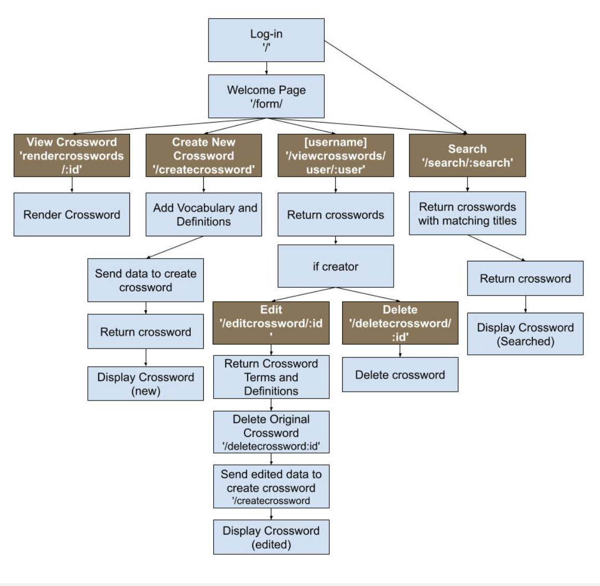
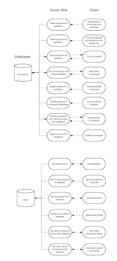

# Project Description

Our application is intended for students who want to learn important class concepts and vocabulary through a fun, interactive experience. We specifically aim to support students who prefer active learning, particularly those who might disengage from lackluster class material. They’ll simply input multiple terms along with their definitions, either manually or by uploading sets from platforms like Quizlet, and we’ll generate a custom crossword puzzle where definitions are clues and terms are answers. 

Students are already familiar with crossword puzzles, many completing the New York Times daily crossword during class downtime. Our application aims to use that urge for quick brain games and redirect it towards academic success. Rather than spacing out during those long lectures, students can solve puzzles generated from public or personal study sets, making the learning process both unmissable and enjoyable.

As developers and students ourselves, we understand the opposite pulls we often feel– to study or not study vs to have fun or not to have fun. We wanted to build a tool that connects that divide and doesn’t make studying feel like a chore. Not only does our application support memory and retention but shows that studying can be fun. Now, academic success is no longer just about who can focus the longest, but who has the most fun.

# Technical Description
## Architectural Diagram

## Dataflow

## Summary Table with User Stories

| Priority | User        | Description                                                                 | Technical Implementation                                                                                                                                     |
|----------|-------------|-----------------------------------------------------------------------------|--------------------------------------------------------------------------------------------------------------------------------------------------------------|
| P0       | As a user   | I want to input a set of words and definitions to generate a crossword with.| User will enter words and definitions on front end interface. Words and definitions will be recorded into a variable and entered into an API to create the crossword. |
| P0       | As a user   | I want to make a crossword with a set of words and definitions              | Crossword is generated based on input words and definitions on the screen for user to view before saving output to MongoDB for later reference.             |
| P0       | As a user   | I want to be able to create an account and log into/out of it.              | Azure Authentication will authenticate users and allow them to login/logout.                                                                                 |
| P0       | As a user   | I want to save and review crosswords I’ve created                           | Users will be able to save the crosswords they created and access/play them again in the future. MongoDB will store the past crosswords.                    |
| P1       | As a user   | I want to be able to save and review my result history.                     | MongoDB will store the user’s history data.                                                                                                                  |
| P1       | As a user   | I want to be able to regenerate a new crossword to study again based on existing word set | Pull data from MongoDB, break it down to the original words and definitions, and send back through API for crossword building.                    |
| P1       | As a user   | I want to be able to find pre-existing crosswords to study or do for fun (search) | Implement search option which will return results for any matching words in the vocabulary, definitions, or other metadata.                         |
| P1       | As a user   | I want to be able to make my crossword private or public, before or after I create and save it. | Model schema will have indicator for public or private, with selector to change that at initial setup or when changing its metadata.            |
| P2       | As a user   | I want to add/edit terms after generating crossword                         | Keep editable word list in frontend state, allow update                                                                                                     |
| P3       | As a user   | I want to generate a crossword and return to it in cache, but do not want to save it to the database | Save the information to local cache.                                                                         |
| P3       | As a user   | I want to be able to import information from pre-existing vocabulary in different formats (csv, txt, from Quizlet?) | Implement an API that can take in data and enter information and then pass it on to the constructor API. A separate API can be set up to skim the information of Quizlet for a specific flashcard. |
| P3       | As a user   | I want to tag my crosswords by different topics                             | Add tags (array?) to MongoDB schema, filter/search support                                                                                                   |
| P3       | As a user   | I want to see basic stats (e.g., total puzzles made, puzzles solved, time to complete) | Aggregate user data on backend, show in a dashboard                                                                 |
| P4       | As users    | I want to collaborate on a crossword with my friends                        | WebSocket integration?                                                                                                                                       |
| P4       | As users    | I want to compare my stats with other users                                 | For all progress entries                                                                                                                                     |

## API Endpoints

GET /signin - Allows users to log into their account.

GET /logout - Allows users to log out their account.

GET /user/:username  - Fetch user's profile info.

GET /user/myIdentity  - Fetch logged in user and save user to MongoDB (if new).

POST /crossword/create - Create a new crossword puzzle with list of words and corresponding definitions

GET /crossword - Get public crosswords

GET /crossword/created - Get crosswords created by a user

GET /crossword/saved - Get crossword saved by a user

GET /crossword/search/:search - Get crosswords titles matching a search query

GET /crossword/:id - Get a specific crossword by ID

DELETE /crossword/:id - Delete a crossword

PUT /crossword/:id  - Edit an existing crossword.

## Database Schemas

- User
	- _id: ObjectId
	- username: String
	- createdCrosswords: Array of ObjectIds (references Crossword)
	- savedCrosswords: Array of ObjectIds (references Crossword)
	
- Crossword
	- _id: ObjectId
	- name: String
	- creator: String
		- name: String
		- webUrl: String
	- date: Date (default: Date.now)
	- webPublicationDate: Date (default: Date.now)
	- entries: Array of objects, each containing:
		- id: String
		- number: Number
		- humanNumber: String
		- clue: String
		- direction: String
		- length: Number
		- group: Array of Strings
		- position:
			- x: Number
			- y: Number
		- separatorLocations: Map (String → Object)
		- solution: String
	- solutionAvailable: Boolean (default: true)
	- dateSolutionAvailable: Date (default: Date.now)
	- dimensions:
		- cols: Number
		- rows: Number
	- crosswordType: String (default: 'quick')
	- pdf: String 
	- isPublic: Boolean (default: false)
